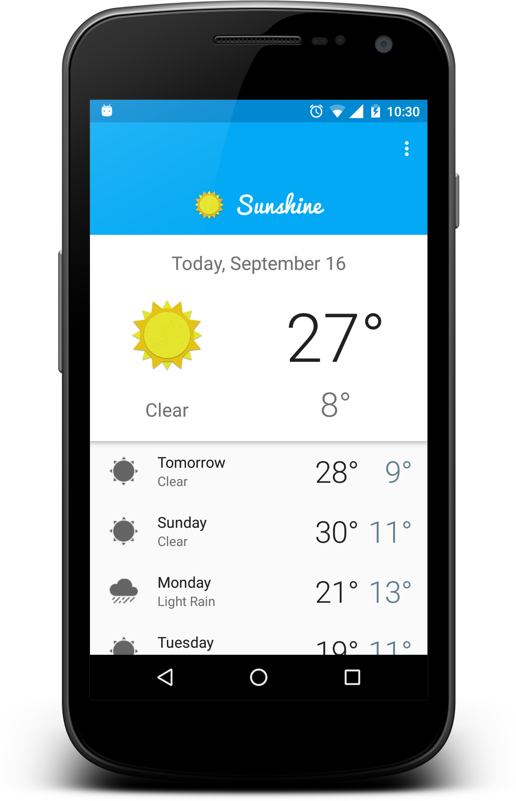
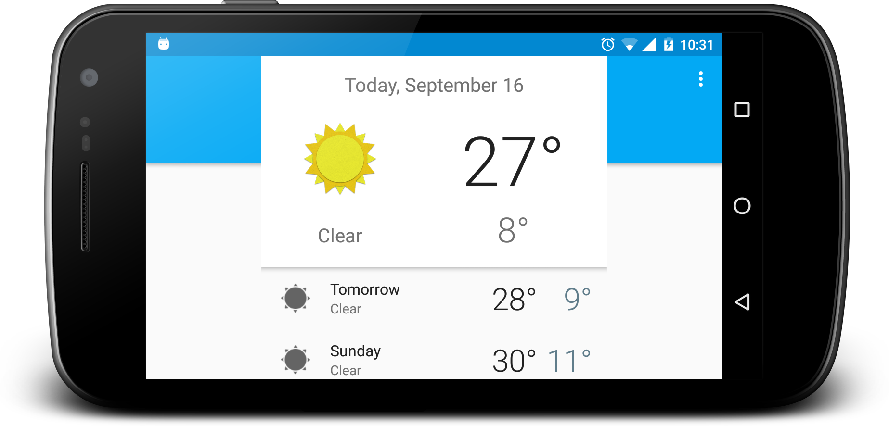
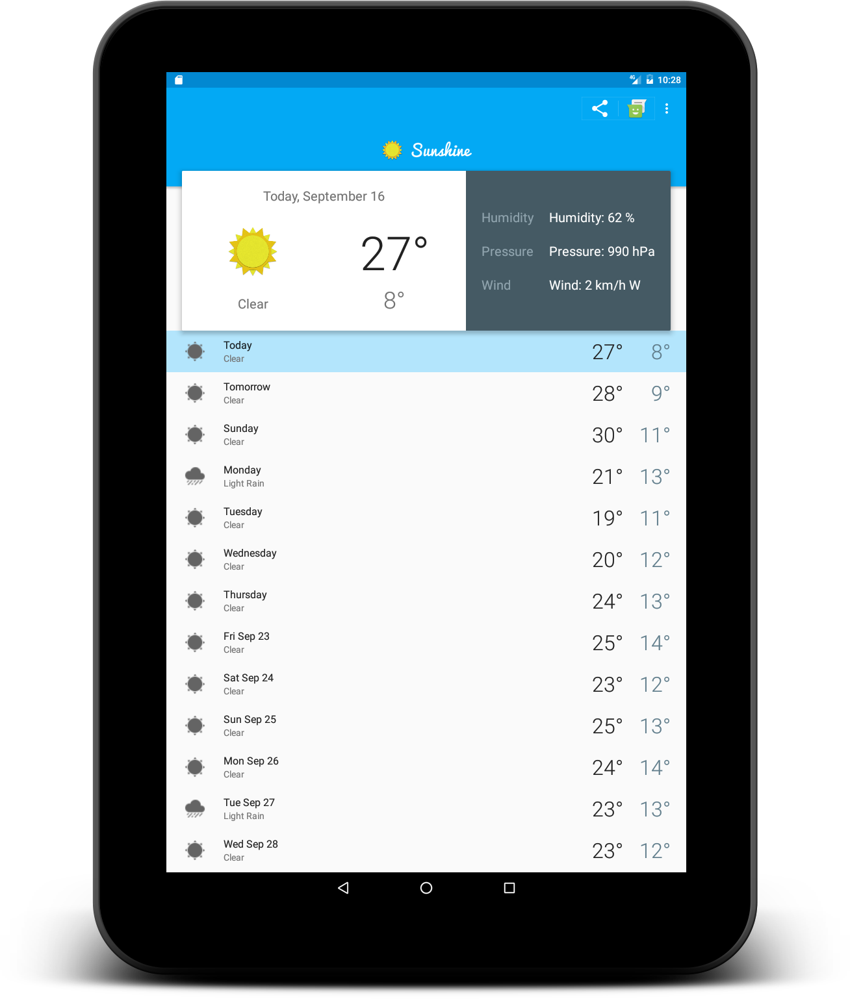
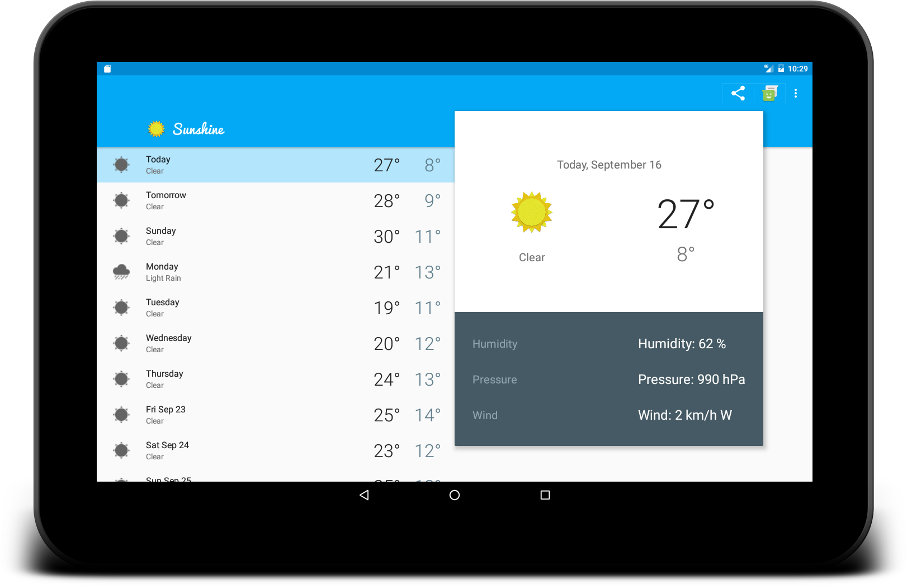
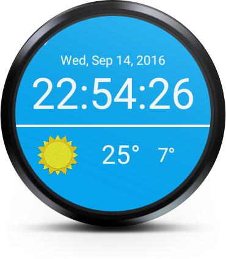

# Sunshine App
==================

A simple Android app, that helps user to monitor weather. App automatically synchronizes after certain time interval and gives weather forecast for the next 14 days. Including High / Low temperatures, humidity levels, wind speed and atmospheric pressure. You can share weather information to your near ones using available mailing apps or messaging apps. It also has the support of ANdroid Wear. You can set wear watchface and get updates from your app to werable device.

[]( []() )
A great companion to your everyday weather needs. 
This app was developed as part of the Udacity course on Android development. This app is built upon advance concepts and features provided by Android framework. This app is very useful for understanding advance Android fundamentals.

**Features:**

- Monitor daily weather info along with High / Low temperatures, humidity levels, wind speed and atmospheric pressure
- Uses Open Weather API for getting weather information
- Uses GCM, ContentProvider, Cursorloader, SyncAdapter for syncing data
- Ability to share the weather forecast with your friends and family via your own messaging / email apps.
- Applied material design concepts - Parallax effect,Recyclerview, Ripple effect, Cardview, Screen transition, Object Animation
- User can select desired location using postal code / map
- Widget support
- Phone and tablet resolution support
- Android wearable support for Square and Round watch-faces

Screenshots
-----------








Developer setup
---------------

### Requirements

- Java 8
- Latest version of Android SDK and Android Build Tools

### API Key

The app uses OpenWeather API to get weather information. You must provide your own [API key][1] in order to build the app.

Just put your API key into "com.portfolio.archit.weathermaster.data.AppConstants.java" file:

```API_KEY
OPEN_WEATHER_MAP_API_KEY="xyz"
```

License
-------

    Copyright 2016 Archit Shah

    Licensed under the Apache License, Version 2.0 (the "License");
    you may not use this file except in compliance with the License.
    You may obtain a copy of the License at

       http://www.apache.org/licenses/LICENSE-2.0

    Unless required by applicable law or agreed to in writing, software
    distributed under the License is distributed on an "AS IS" BASIS,
    WITHOUT WARRANTIES OR CONDITIONS OF ANY KIND, either express or implied.
    See the License for the specific language governing permissions and
    limitations under the License.

[1]: https://home.openweathermap.org/users/sign_up
